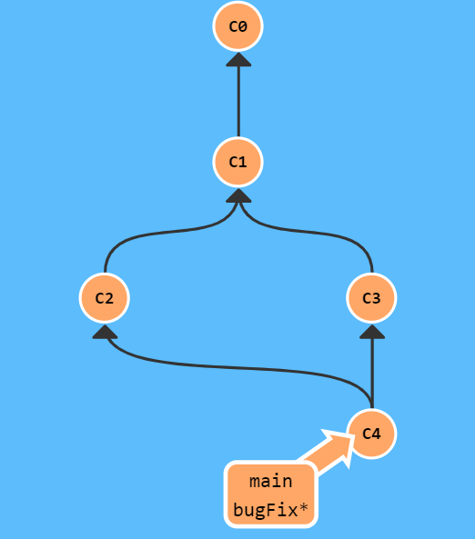
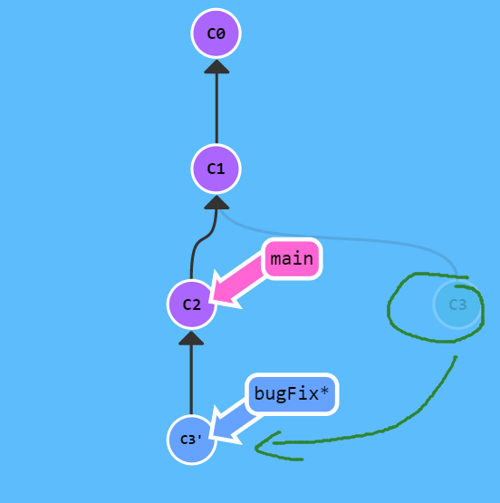

# Git branching learning  
https://learngitbranching.js.org/?demo=&locale=zh_CN  


```python
基础
git help <command>: 获取 git 命令的帮助信息
git init: 创建一个新的 git 仓库，其数据会存放在一个名为 .git 的目录下
git status: 显示当前的仓库状态
git add <filename>: 添加文件到暂存区
git commit: 创建一个新的提交
git log: 显示历史日志
git log --all --graph --decorate: 可视化历史记录（有向无环图）
git diff <filename>: 显示与暂存区文件的差异
git diff <revision> <filename>: 显示某个文件两个版本之间的差异
git checkout <revision>: 更新 HEAD 和目前的分支

```
```
分支和合并
git branch: 显示分支
git branch <name>: 创建分支
git checkout -b <name>: 创建分支并切换到该分支
相当于 git branch <name>; git checkout <name>
git merge <revision>: 合并到当前分支
git mergetool: 使用工具来处理合并冲突
git rebase: 将一系列补丁变基（rebase）为新的基线

```
```
远端操作
git remote: 列出远端
git remote add <name> <url>: 添加一个远端
git push <remote> <local branch>:<remote branch>: 将对象传送至远端并更新远端引用
git branch --set-upstream-to=<remote>/<remote branch>: 创建本地和远端分支的关联关系
git fetch: 从远端获取对象/索引
git pull: 相当于 git fetch; git merge
git clone: 从远端下载仓库
```

```
撤销
git commit --amend: 编辑提交的内容或信息
git reset HEAD <file>: 恢复暂存的文件
git checkout -- <file>: 丢弃修改
git restore: git2.32版本后取代git reset 进行许多撤销操作
```

```
Git 高级操作
git config: Git 是一个 高度可定制的 工具
git clone --depth=1: 浅克隆（shallow clone），不包括完整的版本历史信息
git add -p: 交互式暂存
git rebase -i: 交互式变基
git blame: 查看最后修改某行的人
git stash: 暂时移除工作目录下的修改内容
git bisect: 通过二分查找搜索历史记录
.gitignore: 指定 故意不追踪的文件
```
 


# Git Branch
 Git 的分支也非常轻量。它们只是简单地指向某个提交纪录.这是因为即使创建再多的分支也不会造成储存或内存上的开销，并且按逻辑分解工作到不同的分支要比维护那些特别臃肿的分支简单多了

+ 建一个到名为 newImage 的分支。
git branch newImage  

    
 

+ 往新分支里提交一些东西  
git commit  
为什么 main 分支前进了，但 newImage 分支还待在原地呢  
这是因为我们没有“在”这个新分支上，看到 main 分支上的那个星号（*）了吗？这表示当前所在的分支是 main。  

    
  
+ Git 我们想要切换到新的分支上  
git checkout <name>  
下面的命令会让我们在提交修改之前先切换到新的分支上  
git checkout newImage; git commit  
这就对了！我们的修改已经保存到新的分支里了。  
    
  


# Git Merge  
如何将两个分支合并到一起。新建一个分支，在其上开发某个新功能，开发完成后再合并回主线。  

+ 我们准备了两个分支，每个分支上各有一个独有的提交。这意味着没有一个分支包含了我们修改的所有内容。  
咱们通过合并这两个分支来解决这个问题。  
git merge bugFix  
    
 我们要把 bugFix 合 main 现在指向了一个拥有两个父节点的提交记录。假如从 main 开始沿着箭头向上看，  
 在到达起点的路上会经过所有的提交记录。这意味着 main 包含了对代码库的所有修改。  
  
+ 把 main 分支合并到 bugFix：
git checkout bugFix; git merge main  
因为 main 继承自 bugFix，Git 什么都不用做，只是简单地把 bugFix 移动到 main 所指向的那个提交记录  
     
  


# Git Rebase
第二种合并分支的方法是 git rebase。Rebase 实际上就是取出一系列的提交记录，“复制”它们，然后在另外一个地方逐个的放下去。Rebase 的优势就是可以创造更线性的提交历史  

+ 把 bugFix 分支里的工作直接移到 main 分支上。使得两个分支的功能按顺序开发，但实际上它们是并行开发的。  
git rebase main  
现在 bugFix 分支上的工作在 main 的最顶端，同时我们也得到了一个更线性的提交序列  
   

+ 切换到了 main 上。把它 rebase 到 bugFix 分支上  
git rebase bugFix  
好了！由于 bugFix 继承自 main，所以 Git 只是简单的把 main 分支的引用向前移动了一下而已  
   
  


# 在 Git 提交树上移动  
## HEAD  
HEAD 是一个对当前检出记录的符号引用 —— 也就是指向你正在其基础上进行工作的提交记录  
HEAD 总是指向当前分支上最近一次提交记录。大多数修改提交树的 Git 命令都是从改变 HEAD 的指向开始的。HEAD 通常情况下是指向分支名的（如 bugFix）。在你提交时，改变了 bugFix 的状态，这一变化通过 HEAD 变得可见。 
